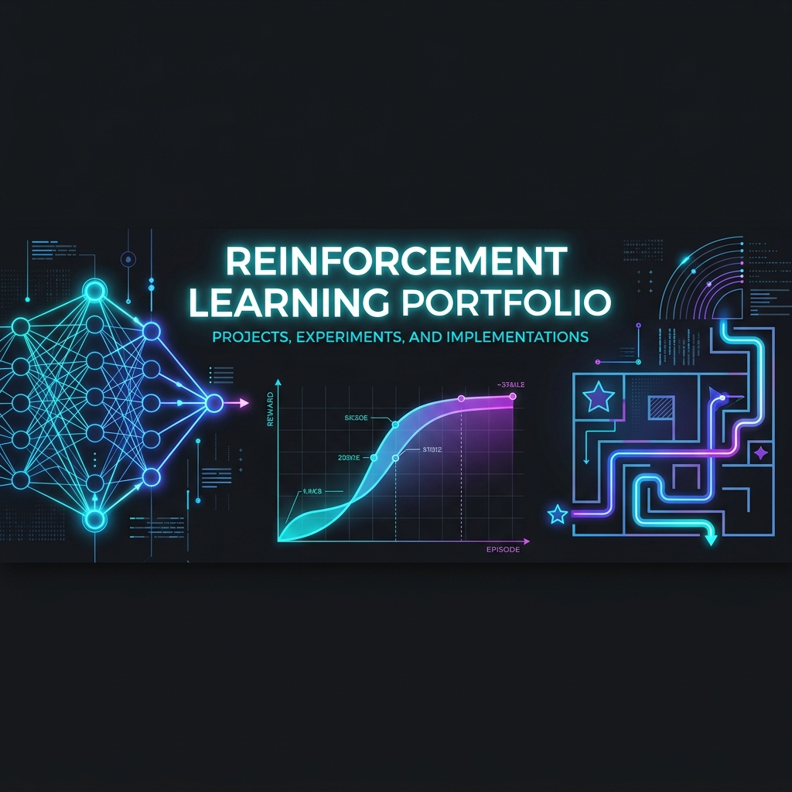
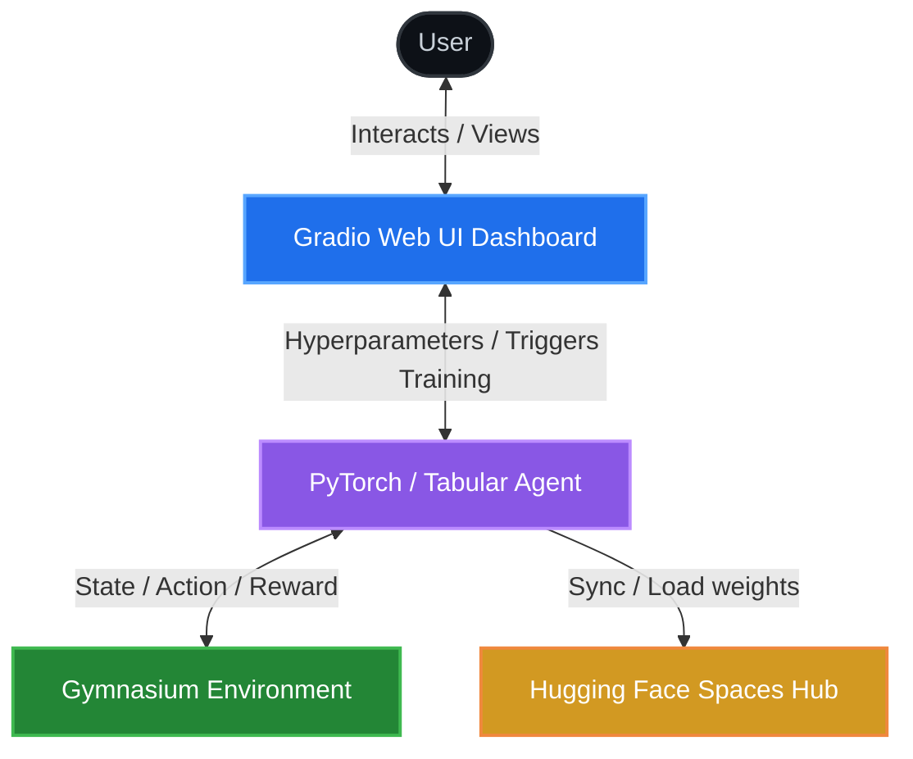
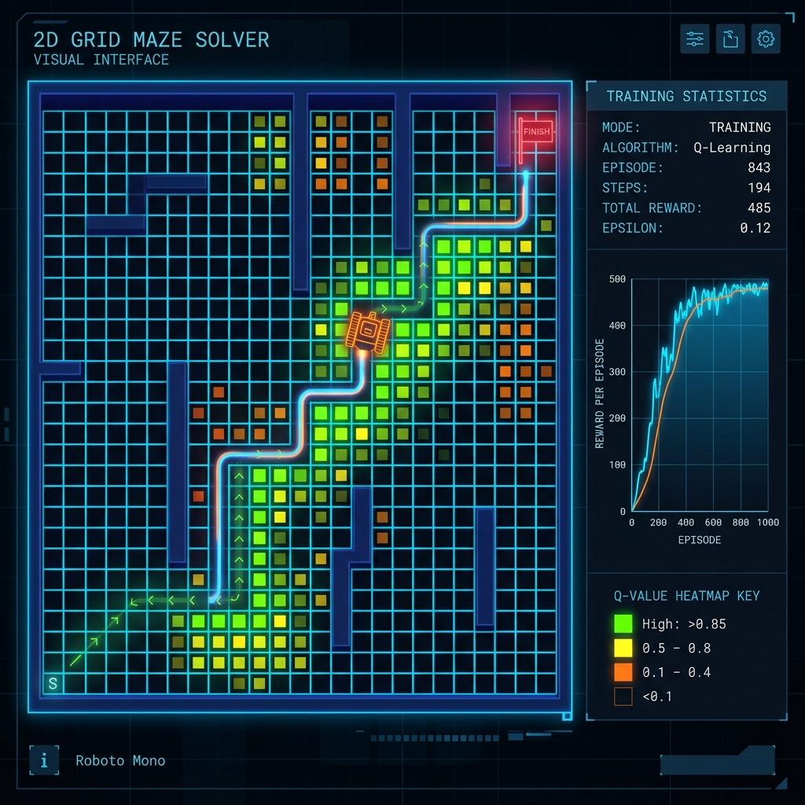
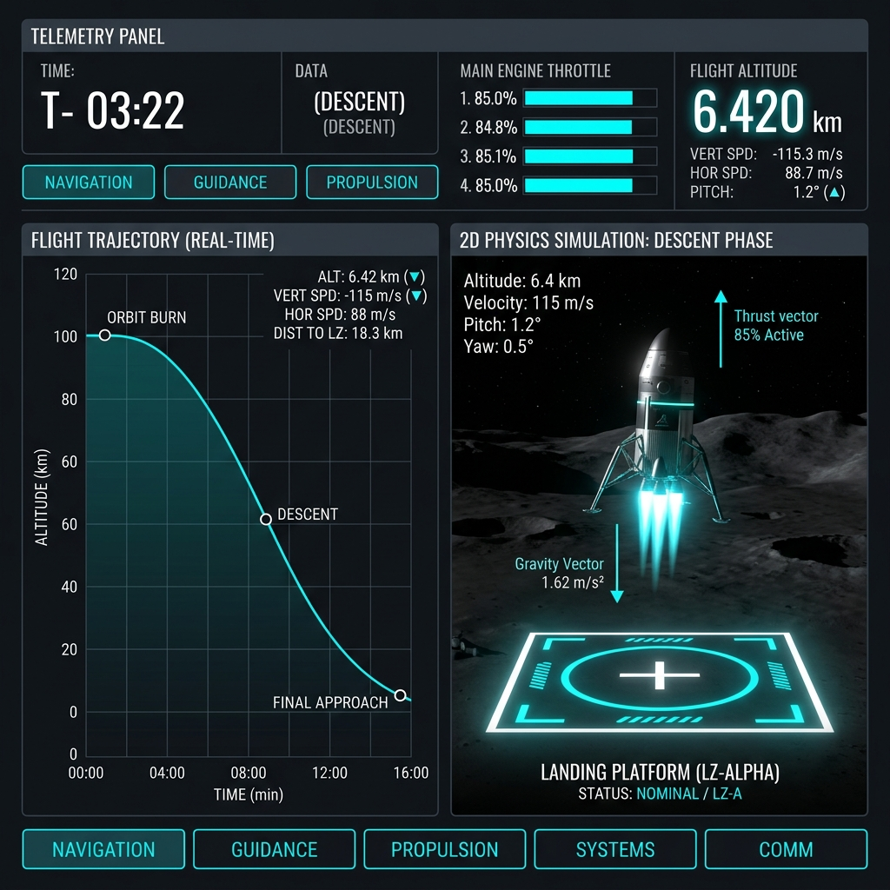
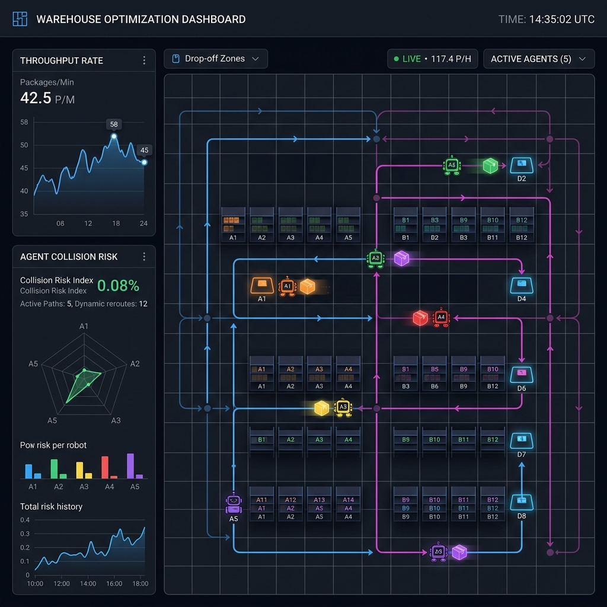
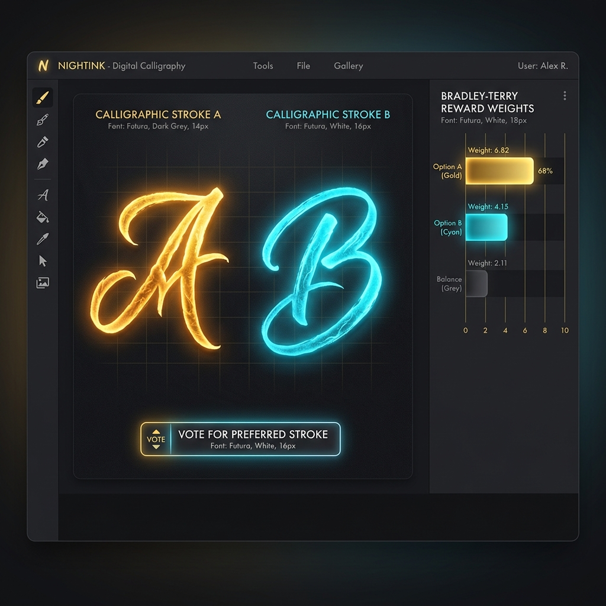
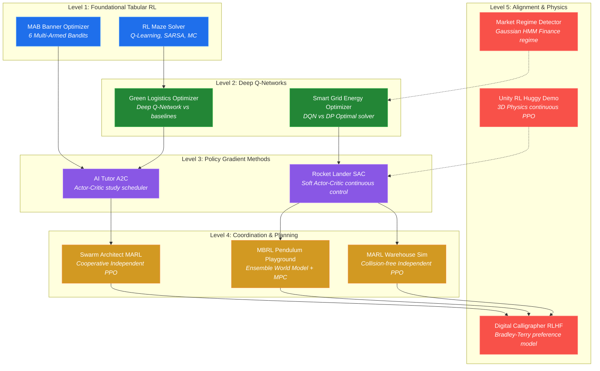

<p align="center">
  
</p>

<p align="center">
  <a href="https://github.com/Dash10107/reinforcement-learning-lab/actions/workflows/lint.yml"></a>
  <a href="https://huggingface.co/spaces/Dash10107"></a>
  <a href="https://colab.research.google.com/github/Dash10107/reinforcement-learning-lab/blob/main/open_in_colab.ipynb"></a>
  <a href="https://github.com/codespaces/new?hide_repo_select=true&ref=main&repo=Dash10107/reinforcement-learning-lab"></a>
  <a href="https://github.com/Dash10107/reinforcement-learning-lab/blob/main/LICENSE"></a>
  <a href="https://github.com/Dash10107/reinforcement-learning-lab/stargazers"></a>
  <a href="https://github.com/Dash10107/reinforcement-learning-lab/issues"></a>
</p>

# Reinforcement Learning Lab

Learn Reinforcement Learning by Building.

An interactive reinforcement learning course and lab featuring 12 end-to-end projects, each deployed as a runnable web application on Hugging Face Spaces. The projects span the full range of modern RL — from the simplest tabular methods that fit on a single page, to multi-agent coordination, model-based planning, and learning from human feedback.

Every project is built to be understood by someone who is new to RL. **This is not just another code repository. It is a place where you can read the concept, see the math, inspect the implementation, run the algorithm, change parameters, and observe the result — all in one place.**

---

## Where to Start

- **I am a beginner** → Start with [RL Maze Solver](./rl_maze_solver) (Q-Learning)
- **I know basic RL** → Start with [Green Logistics Optimizer](./green-logistics-optimizer) (DQN)
- **I want deep RL** → Start with [Rocket Lander SAC](./rocket-lander-sac) (Continuous Control)
- **I want RLHF** → Start with [Digital Calligrapher RLHF](./digital-calligrapher-rlhf) (Alignment)
- **I want multi-agent RL** → Start with [MARL Warehouse Sim](./marl-warehouse-sim) (IPPO)
- **I just want the full course** → [Visit the Official Lab Website](https://dash10107.github.io/reinforcement-learning-lab/)

---

## Algorithms Covered

Q-Learning, SARSA, Monte Carlo, Temporal Difference (TD) Learning, Deep Q-Network (DQN), Advantage Actor-Critic (A2C), Proximal Policy Optimization (PPO), Soft Actor-Critic (SAC), Independent PPO (IPPO), Model-Based RL (MBRL), and Reinforcement Learning from Human Feedback (RLHF).


---

## Key Highlights

*   ⚡ **Zero-Install Interactive Demos**: Every project is deployed live on Hugging Face Spaces for instant testing.
*   🎓 **Curriculum-Based Learning Path**: 12 modular projects spanning tabular methods, deep RL, policy gradients, multi-agent coordination, model-based planning, and alignment.
*   🛠️ **Production-Grade UI**: Built-in training labs, parameter tuning sliders, real-time convergence charts, and policy heatmaps.
*   📦 **One-Click Cloud Development**: Pre-configured GitHub Codespaces and Google Colab environments to write and run code instantly in your browser.

---

## System Architecture

All projects in this repository separate algorithm design, user interaction, environment dynamics, and remote registry hosting:



---

## Featured Project Showcase

Here are four representative projects showcasing tabular, continuous, multi-agent, and alignment paradigms:

<table width="100%">
  <tr>
    <td width="50%" valign="top">
      <h3 align="center">🤖 Tabular RL: Maze Solver</h3>
      <a href="https://huggingface.co/spaces/Dash10107/rl_maze_solver">
        
      </a>
      <p>Three classic tabular RL algorithms (Q-Learning, SARSA, and Monte Carlo) race to solve procedurally generated mazes. Features interactive convergence curves and real-time state-value (Q-value) heatmaps.</p>
      <p align="center">
        <a href="./rl_maze_solver"><b>📂 Code Directory</b></a> | 
        <a href="https://huggingface.co/spaces/Dash10107/rl_maze_solver"><b>🚀 Live Space Demo</b></a>
      </p>
    </td>
    <td width="50%" valign="top">
      <h3 align="center">🚀 Deep Continuous: Rocket Lander</h3>
      <a href="https://huggingface.co/spaces/Dash10107/rocket-lander-sac">
        
      </a>
      <p>A continuous throttle/gimbal rocket lander trained using Soft Actor-Critic (SAC). Features customizable wind/gravity parameters, telemetry gauges, flight trajectories, and browser-based fine-tuning.</p>
      <p align="center">
        <a href="./rocket-lander-sac"><b>📂 Code Directory</b></a> | 
        <a href="https://huggingface.co/spaces/Dash10107/rocket-lander-sac"><b>🚀 Live Space Demo</b></a>
      </p>
    </td>
  </tr>
  <tr>
    <td width="50%" valign="top">
      <h3 align="center">📦 Multi-Agent RL: Warehouse Sim</h3>
      <a href="https://huggingface.co/spaces/Dash10107/marl-warehouse-sim">
        
      </a>
      <p>Robots coordinate package deliveries in a custom 12x12 grid using Independent PPO (IPPO). Evaluates coordination, collision avoidance, and pathfinding optimization in multi-agent environments.</p>
      <p align="center">
        <a href="./marl-warehouse-sim"><b>📂 Code Directory</b></a> | 
        <a href="https://huggingface.co/spaces/Dash10107/marl-warehouse-sim"><b>🚀 Live Space Demo</b></a>
      </p>
    </td>
    <td width="50%" valign="top">
      <h3 align="center">🎨 Human Alignment: Calligrapher RLHF</h3>
      <a href="https://huggingface.co/spaces/Dash10107/digital-calligrapher-rlhf">
        
      </a>
      <p>A Bradley-Terry pairwise preference model aligned using Reinforcement Learning from Human Feedback (RLHF). Learns aesthetic preference vectors to generate customized calligraphic strokes.</p>
      <p align="center">
        <a href="./digital-calligrapher-rlhf"><b>📂 Code Directory</b></a> | 
        <a href="https://huggingface.co/spaces/Dash10107/digital-calligrapher-rlhf"><b>🚀 Live Space Demo</b></a>
      </p>
    </td>
  </tr>
</table>

---

## Interactive Curriculum Roadmap

Our curriculum builds your reinforcement learning knowledge progressively across five key stages:



---

## Project Index & Summaries

Explore all 12 projects in detail below:

<details>
<summary><b>1. AI Tutor A2C</b> (Actor-Critic subject study schedules)</summary>
<br>

An A2C agent that learns to recommend which subject a student should study next across five subjects (Mathematics, Physics, Literature, History, Computer Science). The environment models both learning gains and forgetting — ignoring a subject for too long causes it to decay. The agent must find a study schedule that keeps all subjects progressing toward mastery.

**Algorithm:** Actor-Critic (A2C) — the actor outputs a probability over subjects, the critic estimates state value, and the advantage function tells the actor which choices were better than expected.

[View project](./AI-Tutor-A2C) · [Live demo](https://huggingface.co/spaces/Dash10107/AI-Tutor-A2C)
</details>

<details>
<summary><b>2. Digital Calligrapher RLHF</b> (Bradley-Terry alignment from votes)</summary>
<br>

A demonstration of Reinforcement Learning from Human Feedback. Two calligraphic brush strokes are shown side by side and you vote for the one that feels more elegant. A Bradley-Terry reward model updates after each vote, learning a 6-dimensional weight vector that represents your aesthetic preferences. After enough votes, a hill-climbing optimiser generates strokes that maximise your learned reward.

**Algorithm:** RLHF with Bradley-Terry pairwise comparison model — the same technique used to align large language models with human values, applied to visual aesthetics.

[View project](./digital-calligrapher-rlhf) · [Live demo](https://huggingface.co/spaces/Dash10107/digital-calligrapher-rlhf)
</details>

<details>
<summary><b>3. Green Logistics Optimizer</b> (DQN vehicle routing in city grid)</summary>
<br>

A DQN agent navigates a city grid to make deliveries while minimising carbon emissions. High-congestion zones multiply fuel cost by 4x. The agent learns to route around them when the detour is worth it. Three strategies run on the same city: the DQN agent, a greedy heuristic that always moves toward the goal, and an A* shortest-path solver.

**Algorithm:** Deep Q-Network (DQN) with experience replay and target network — the agent learns a Q-function mapping (position, congestion layout) to expected future reward for each direction.

[View project](./green-logistics-optimizer) · [Live demo](https://huggingface.co/spaces/Dash10107/green-logistics-optimizer)
</details>

<details>
<summary><b>4. MAB Banner Optimizer</b> (6 multi-armed bandit strategies)</summary>
<br>

Six multi-armed bandit algorithms compete on the same ad campaign: Epsilon-Greedy, Decaying Epsilon-Greedy, UCB1, Thompson Sampling, Gradient Bandit, and EXP3. Each algorithm sees the same banner impressions and tries to figure out which banner variant has the highest click-through rate. Their cumulative reward and regret curves are plotted side by side. A step-through learner mode lets you watch each algorithm make individual decisions.

**Algorithms:** All six major bandit strategies — from the simplest (epsilon-greedy) to the Bayesian (Thompson Sampling) and the adversarial (EXP3).

[View project](./mab-banner-optimizer) · [Live demo](https://huggingface.co/spaces/Dash10107/mab-banner-optimizer)
</details>

<details>
<summary><b>5. Market Regime Detector HMM</b> (Gaussian HMM financial state estimation)</summary>
<br>

A Gaussian Hidden Markov Model identifies recurring market states in historical stock data: Bull (positive drift, low volatility), Neutral (mixed signals), Bear (negative drift), and Crisis (extreme volatility). The price chart is coloured by regime, the transition matrix shows how likely each regime is to follow each other, and a backtest compares a regime-switching trading strategy against buy-and-hold.

**Algorithm:** Gaussian HMM trained via Baum-Welch EM, decoded via Viterbi. BIC model selection picks the optimal number of hidden states automatically.

[View project](./market-regime-detector-hmm) · [Live demo](https://huggingface.co/spaces/Dash10107/market-regime-detector-hmm)
</details>

<details>
<summary><b>6. MARL Warehouse Sim</b> (Coordinated Independent PPO package delivery)</summary>
<br>

A team of robots operates inside a custom 12x12 warehouse grid. Each robot picks up packages from loading zones and delivers them to drop-off zones. Robots trained with Independent PPO learn to spread across the warehouse and claim different tasks without colliding, rather than all clustering around the same pickup zone.

**Algorithm:** Independent PPO (IPPO) — each robot maintains its own Actor-Critic pair with no shared parameters or centralised communication.

[View project](./marl-warehouse-sim) · [Live demo](https://huggingface.co/spaces/Dash10107/marl-warehouse-sim)
</details>

<details>
<summary><b>7. MBRL Pendulum Playground</b> (Model-Based RL ensemble + MPC planner)</summary>
<br>

A complete Model-Based RL system for the classic Pendulum control task. A neural ensemble of five dynamics models is trained on random exploration data, then used for planning via Random Shooting MPC: at each step, 512 random action sequences are rolled out in the learned model and the best one is selected. An imagination rollout visualiser shows how prediction error grows with horizon length — the central challenge of model-based planning.

**Algorithm:** Ensemble dynamics model (bootstrap training, epistemic uncertainty via model disagreement) + Random Shooting MPC with discounted reward planning.

[View project](./mbrl-pendulum-playground) · [Live demo](https://huggingface.co/spaces/Dash10107/mbrl-pendulum-playground)
</details>

<details>
<summary><b>8. RL Maze Solver</b> (Tabular Q-Learning, SARSA, and Monte Carlo)</summary>
<br>

Three tabular RL algorithms are trained to navigate procedurally generated mazes: Q-Learning (off-policy TD), SARSA (on-policy TD), and First-Visit Monte Carlo. The playground tab shows the animated solution path and Q-value heatmap for any chosen algorithm. The algorithm race tab plots their convergence curves side by side on the same maze.

**Algorithms:** Q-Learning, SARSA, and Monte Carlo — the three foundational methods from Sutton and Barto's RL textbook, all implemented from scratch using only NumPy.

[View project](./rl_maze_solver) · [Live demo](https://huggingface.co/spaces/Dash10107/rl_maze_solver)
</details>

<details>
<summary><b>9. Rocket Lander SAC</b> (Continuous Soft Actor-Critic throttle landing)</summary>
<br>

A Soft Actor-Critic agent controls two engine throttles to land a rocket on the LunarLander-v3 platform. SAC maximises both expected reward and policy entropy, which leads to natural, exploratory behaviour during training and robust performance at test time. The app shows animated episode replays with throttle overlays, flight trajectories, and full mission analytics. A fine-tuning lab lets you continue training the pre-trained model in the browser.

**Algorithm:** SAC with dual critics, target networks, and automatic entropy tuning — one of the best off-policy algorithms for continuous control tasks.

[View project](./rocket-lander-sac) · [Live demo](https://huggingface.co/spaces/Dash10107/rocket-lander-sac)
</details>

<details>
<summary><b>10. Smart Grid Energy Optimizer</b> (Discrete DQN battery market management)</summary>
<br>

A DQN agent manages a battery energy storage system over a 24-hour electricity market cycle. It decides each hour whether to charge (buy electricity), discharge (sell or offset load), or hold. Solar generation and building load vary throughout the day. The agent is compared against a dynamic programming optimal solver (perfect foresight upper bound) and a price-threshold heuristic baseline.

**Algorithm:** DQN for the learned policy; DP backward induction for the optimal solver; price-threshold rule for the heuristic baseline.

[View project](./smart-grid-energy-optimizer) · [Live demo](https://huggingface.co/spaces/Dash10107/smart-grid-energy-optimizer)
</details>

<details>
<summary><b>11. Swarm Architect MARL</b> (Independent PPO landmark coverage)</summary>
<br>

Five agents learn to cooperatively spread across a continuous 2D space to cover five landmarks. No agent is told which landmark to target — they must implicitly divide the landmarks among themselves through experience. The task comes from PettingZoo's Multi-Particle Environment suite and is a standard benchmark for cooperative multi-agent RL.

**Algorithm:** Independent PPO (IPPO) — same algorithm as the Warehouse Sim but in a continuous action space with a different coordination challenge.

[View project](./swarm-architect-marl) · [Live demo](https://huggingface.co/spaces/Dash10107/swarm-architect-marl)
</details>

<details>
<summary><b>12. Unity RL Huggy Demo</b> (Unity ML-Agents PPO WebGL fetch simulation)</summary>
<br>

A pre-trained Unity ML-Agents character that learned to fetch a stick through millions of physics simulation steps. Huggy controls joint torques on a physically simulated dog body and must discover running, turning, and timing entirely from a sparse reward signal. The demo runs as a WebGL application in the browser.

**Algorithm:** PPO via Unity ML-Agents — the same policy gradient algorithm used in several other projects, applied to a 3D continuous control problem.

[View project](./Unity-RL-Huggy-Demo) · [Live demo](https://huggingface.co/spaces/Dash10107/Unity-RL-Huggy-Demo)
</details>

---

## Getting Started

### Run any project individually

Each project has its own `requirements.txt` and can be run standalone:

```bash
cd rocket-lander-sac
pip install -r requirements.txt
python app.py
```

### Set up a shared environment for all projects

A root-level `requirements.txt` and setup script installs everything needed for all 11 projects into a single virtual environment:

**On Windows (PowerShell):**

```powershell
.\setup_env.ps1
```

**On Mac or Linux:**

```bash
python -m venv .venv
source .venv/bin/activate
pip install -r requirements.txt
```

Then activate the environment before running any project:

```powershell
# Windows
.venv\Scripts\activate

# Mac / Linux
source .venv/bin/activate
```

---

## 🛠️ Build Your Own Project (Fork & Learn)

The best way to learn Reinforcement Learning is to break it, modify it, and rebuild it. We encourage you to **fork this repository** and try completing the following challenges on your own:

### Beginner Challenges
- **Challenge 01**: Train the `rl_maze_solver` DQN agent to solve the classic `CartPole-v1` environment instead of a maze.
- **Challenge 02**: Modify the epsilon-decay schedule in `mab-banner-optimizer` and observe how it impacts the UCB algorithm's convergence.

### Intermediate Challenges
- **Challenge 03**: Modify the PPO entropy coefficient in `swarm-architect-marl` and visualize the difference in agent exploration.
- **Challenge 04**: Create your own custom reward function for the `rocket-lander-sac` that severely penalizes horizontal velocity, forcing a strictly vertical descent.

### Advanced Challenges
- **Challenge 05**: Swap the Bradley-Terry preference model in `digital-calligrapher-rlhf` for a different reward modeling technique (like DPO).
- **Challenge 06**: Build a two-agent cooperative environment from scratch using the Independent PPO structure provided.

If you build something cool, open a Pull Request or share it in the issues!

---


## Tech Stack

| Category | Libraries |
|---|---|
| RL algorithms | Stable-Baselines3, custom PyTorch implementations |
| Environments | Gymnasium, PettingZoo, custom environments |
| Statistical ML | hmmlearn, scikit-learn |
| Financial data | yfinance |
| Visualisation | matplotlib, PIL |
| Web interface | Gradio |
| Deep learning | PyTorch |

---

## Repository Structure

```
ReinforcementLearning/
├── .devcontainer/                  Codespaces container setup
├── .github/
│   ├── ISSUE_TEMPLATE/             Bug & Feature templates
│   └── workflows/                  Ruff CI linting & HF Space syncing
├── assets/                         Visual branding resources
├── README.md                       This file
├── LICENSE                         MIT License
├── CONTRIBUTING.md                 Contribution guidelines
├── CODE_OF_CONDUCT.md              Community code of conduct
├── SECURITY.md                     Security policy
├── SUPPORT.md                      Support guide
├── open_in_colab.ipynb             Google Colab one-click launcher
├── requirements.txt                Shared dependencies for all projects
├── setup_env.ps1                   Windows PowerShell setup script
├── .gitignore
│
├── AI-Tutor-A2C/
├── digital-calligrapher-rlhf/
├── green-logistics-optimizer/
├── mab-banner-optimizer/
├── market-regime-detector-hmm/
├── marl-warehouse-sim/
├── mbrl-pendulum-playground/
├── rl_maze_solver/
├── rocket-lander-sac/
├── smart-grid-energy-optimizer/
├── swarm-architect-marl/
└── Unity-RL-Huggy-Demo/
```

Each project directory contains its own `app.py`, `README.md`, `requirements.txt`, and module subdirectories.
