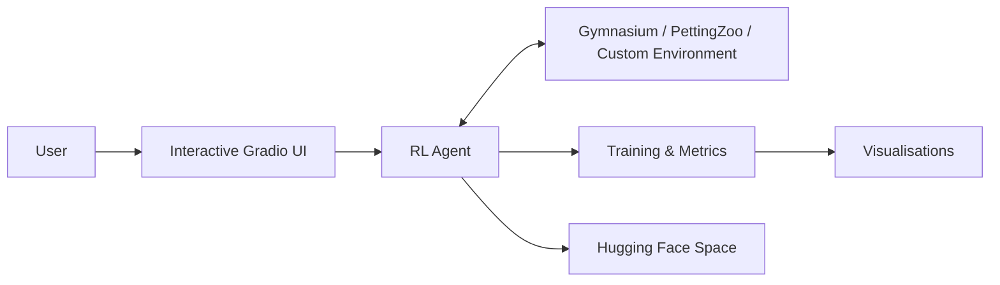

<p align="center">
  
</p>

<p align="center">
  <a href="https://dash10107.github.io/reinforcement-learning-lab/en/">
    
  </a>
  <a href="https://huggingface.co/spaces/Dash10107">
    
  </a>
  <a href="https://github.com/Dash10107/reinforcement-learning-lab/stargazers">
    
  </a>
  <a href="https://github.com/Dash10107/reinforcement-learning-lab/network/members">
    
  </a>
</p>

<p align="center">
  <a href="https://github.com/Dash10107/reinforcement-learning-lab/actions/workflows/lint.yml">
    
  </a>
  <a href="https://github.com/Dash10107/reinforcement-learning-lab/blob/main/LICENSE">
    
  </a>
  <a href="https://github.com/Dash10107/reinforcement-learning-lab">
    
  </a>
  <a href="https://github.com/Dash10107/reinforcement-learning-lab/issues">
    
  </a>
</p>

<h1 align="center">Reinforcement Learning Lab</h1>

<p align="center">
  <strong>Learn Reinforcement Learning by Building.</strong>
</p>

<p align="center">
  An open-source, interactive reinforcement learning course and project lab —
  from multi-armed bandits and Q-Learning to DQN, PPO, SAC, multi-agent RL,
  model-based RL, and RLHF.
</p>

<p align="center">
  <strong>Read the idea → understand the math → inspect the code → run the agent → change the parameters → see what happens.</strong>
</p>

---

## 🌐 Start Here

### [→ Open the full Reinforcement Learning Lab course](https://dash10107.github.io/reinforcement-learning-lab/en/)

The course is designed as a progressive learning path, while this repository contains the implementations, experiments, demos, and source code behind it.

| I want to... | Start here |
|---|---|
| **Learn RL from the beginning** | [RL Maze Solver](./rl_maze_solver) |
| **Understand Q-Learning / SARSA / Monte Carlo** | [RL Maze Solver](./rl_maze_solver) |
| **Learn Deep Q-Networks (DQN)** | [Green Logistics Optimizer](./green-logistics-optimizer) |
| **Understand Actor-Critic / A2C** | [AI Tutor A2C](./AI-Tutor-A2C) |
| **Learn continuous-control RL** | [Rocket Lander SAC](./rocket-lander-sac) |
| **Learn multi-agent RL** | [MARL Warehouse Sim](./marl-warehouse-sim) |
| **Understand Model-Based RL** | [MBRL Pendulum Playground](./mbrl-pendulum-playground) |
| **See RLHF in an interactive setting** | [Digital Calligrapher RLHF](./digital-calligrapher-rlhf) |
| **Explore all projects** | [Project Index](#-project-index) |
| **Run a live demo without installing anything** | [Hugging Face Spaces](https://huggingface.co/spaces/Dash10107) |

---

# Why this repository exists

Reinforcement learning is often taught in one of two ways:

1. **Theory first** — equations, Bellman updates, policy gradients, proofs.
2. **Library first** — call a high-level API, train an agent, and hope the implementation becomes intuitive.

There is a gap between the two.

**Reinforcement Learning Lab is built to bridge it.**

Every project is designed so that you can move through the complete loop:

```text
Concept
   ↓
Intuition
   ↓
Mathematics
   ↓
Implementation
   ↓
Experiment
   ↓
Interactive Demo
   ↓
Modification
```

The goal is not just to show that an agent can learn.

The goal is to help you understand **why it learns, when it fails, and what changes when you alter the algorithm or environment.**

---

# ✨ What you get

- **12 end-to-end RL projects** covering foundational, deep, policy-gradient, multi-agent, model-based, and alignment settings.
- **Interactive browser demos** hosted on Hugging Face Spaces.
- **From-scratch implementations** alongside practical deep-RL tooling.
- **Visual experiments** with learning curves, trajectories, value maps, policy behaviour, and environment dynamics.
- **A structured curriculum** rather than an unconnected collection of notebooks.
- **GitHub Codespaces + Google Colab support** for browser-based development.
- **Fork-and-build challenges** so you can turn the repository into your own RL playground.
- **A dedicated course website** with concept explanations and guided modules.

---

# 🧠 Algorithms & Concepts Covered

### Foundations

- Multi-Armed Bandits
- Epsilon-Greedy
- UCB1
- Thompson Sampling
- Gradient Bandit
- EXP3
- Monte Carlo Reinforcement Learning
- Temporal-Difference Learning
- SARSA
- Q-Learning

### Deep Reinforcement Learning

- Deep Q-Networks (DQN)
- Experience Replay
- Target Networks
- Value-based baselines
- Discrete control

### Policy Gradient & Actor-Critic

- Advantage Actor-Critic (A2C)
- Actor-Critic architecture
- Policy gradients
- Proximal Policy Optimization (PPO)
- Soft Actor-Critic (SAC)
- Entropy regularisation
- Continuous control

### Multi-Agent Reinforcement Learning

- Independent PPO (IPPO)
- Cooperative multi-agent learning
- Coordination
- Collision avoidance
- Task allocation
- Continuous multi-agent control

### Model-Based RL

- Learned dynamics models
- Ensemble models
- Epistemic uncertainty through model disagreement
- Model Predictive Control (MPC)
- Random-shooting planning
- Imagination rollouts

### Alignment

- Reinforcement Learning from Human Feedback (RLHF)
- Pairwise preference modelling
- Bradley-Terry reward modelling
- Preference-driven optimisation

### Beyond the core curriculum

- Hidden Markov Models
- Unity ML-Agents
- Physics-based environments
- Financial regime detection
- Applied optimisation environments

---

# 🚀 Featured Projects

These four projects show the range of the lab — from tabular learning to continuous control, multi-agent coordination, and human preference learning.

<table width="100%">
  <tr>
    <td width="50%" valign="top">
      <h3 align="center">🤖 RL Maze Solver</h3>
      <a href="https://huggingface.co/spaces/Dash10107/rl_maze_solver">
        
      </a>
      <p>
        Compare Q-Learning, SARSA, and Monte Carlo while watching agents learn to solve procedurally generated mazes. Inspect convergence curves, solution paths, and Q-value heatmaps.
      </p>
      <p align="center">
        <a href="./rl_maze_solver"><strong>📂 Source</strong></a> ·
        <a href="https://huggingface.co/spaces/Dash10107/rl_maze_solver"><strong>🚀 Live Demo</strong></a>
      </p>
    </td>
    <td width="50%" valign="top">
      <h3 align="center">🚀 Rocket Lander SAC</h3>
      <a href="https://huggingface.co/spaces/Dash10107/rocket-lander-sac">
        
      </a>
      <p>
        Train a Soft Actor-Critic agent to control a rocket in continuous action space. Experiment with wind and gravity, inspect telemetry, replay flights, and fine-tune the agent in the browser.
      </p>
      <p align="center">
        <a href="./rocket-lander-sac"><strong>📂 Source</strong></a> ·
        <a href="https://huggingface.co/spaces/Dash10107/rocket-lander-sac"><strong>🚀 Live Demo</strong></a>
      </p>
    </td>
  </tr>
  <tr>
    <td width="50%" valign="top">
      <h3 align="center">📦 MARL Warehouse Sim</h3>
      <a href="https://huggingface.co/spaces/Dash10107/marl-warehouse-sim">
        
      </a>
      <p>
        Multiple robots learn to coordinate package deliveries in a custom warehouse environment using Independent PPO. Observe task allocation, exploration, and collision avoidance.
      </p>
      <p align="center">
        <a href="./marl-warehouse-sim"><strong>📂 Source</strong></a> ·
        <a href="https://huggingface.co/spaces/Dash10107/marl-warehouse-sim"><strong>🚀 Live Demo</strong></a>
      </p>
    </td>
    <td width="50%" valign="top">
      <h3 align="center">🎨 Digital Calligrapher RLHF</h3>
      <a href="https://huggingface.co/spaces/Dash10107/digital-calligrapher-rlhf">
        
      </a>
      <p>
        Vote between generated brush strokes, learn a preference model from those choices, and optimise new outputs toward your learned aesthetic preferences.
      </p>
      <p align="center">
        <a href="./digital-calligrapher-rlhf"><strong>📂 Source</strong></a> ·
        <a href="https://huggingface.co/spaces/Dash10107/digital-calligrapher-rlhf"><strong>🚀 Live Demo</strong></a>
      </p>
    </td>
  </tr>
</table>

---

# 🗺️ Learning Path

The lab is designed to progress from simple tabular problems to modern RL systems.

```text
LEVEL 1 — FOUNDATIONS
    │
    ├── Multi-Armed Bandits
    ├── Exploration vs Exploitation
    ├── Monte Carlo
    ├── TD Learning
    ├── SARSA
    └── Q-Learning
            │
            ▼
LEVEL 2 — DEEP VALUE-BASED RL
    │
    ├── DQN
    ├── Experience Replay
    ├── Target Networks
    └── Applied discrete control
            │
            ▼
LEVEL 3 — POLICY GRADIENTS & ACTOR-CRITIC
    │
    ├── A2C
    ├── PPO
    ├── SAC
    └── Continuous control
            │
            ▼
LEVEL 4 — COORDINATION & PLANNING
    │
    ├── Multi-Agent RL
    ├── Independent PPO
    ├── Model-Based RL
    └── Model Predictive Control
            │
            ▼
LEVEL 5 — ALIGNMENT & ADVANCED SYSTEMS
    │
    ├── RLHF
    ├── Preference Modelling
    ├── Unity / Physics Environments
    └── Applied RL Systems
```

### Recommended order

**Beginner →** Bandits → Monte Carlo → TD → SARSA → Q-Learning → DQN → A2C → PPO → SAC → MARL → MBRL → RLHF

You do not need to follow the sequence strictly. Each project is independently runnable and documented.

---

# 🔬 Project Index

| # | Project | Main Algorithm / Method | What you learn | Demo |
|---:|---|---|---|---|
| 1 | [AI Tutor A2C](./AI-Tutor-A2C) | A2C / Actor-Critic | State values, advantages, policy learning | [▶ Demo](https://huggingface.co/spaces/Dash10107/AI-Tutor-A2C) |
| 2 | [Digital Calligrapher RLHF](./digital-calligrapher-rlhf) | RLHF + Bradley-Terry | Preference learning and reward modelling | [▶ Demo](https://huggingface.co/spaces/Dash10107/digital-calligrapher-rlhf) |
| 3 | [Green Logistics Optimizer](./green-logistics-optimizer) | DQN | Experience replay, target networks, routing | [▶ Demo](https://huggingface.co/spaces/Dash10107/green-logistics-optimizer) |
| 4 | [MAB Banner Optimizer](./mab-banner-optimizer) | Bandits | Exploration, regret, Bayesian/adversarial strategies | [▶ Demo](https://huggingface.co/spaces/Dash10107/mab-banner-optimizer) |
| 5 | [Market Regime Detector HMM](./market-regime-detector-hmm) | Gaussian HMM | Hidden states, Viterbi, Baum-Welch, model selection | [▶ Demo](https://huggingface.co/spaces/Dash10107/market-regime-detector-hmm) |
| 6 | [MARL Warehouse Sim](./marl-warehouse-sim) | Independent PPO | Multi-agent coordination and collision avoidance | [▶ Demo](https://huggingface.co/spaces/Dash10107/marl-warehouse-sim) |
| 7 | [MBRL Pendulum Playground](./mbrl-pendulum-playground) | Ensemble + MPC | Learned dynamics, uncertainty, planning | [▶ Demo](https://huggingface.co/spaces/Dash10107/mbrl-pendulum-playground) |
| 8 | [RL Maze Solver](./rl_maze_solver) | Q-Learning + SARSA + MC | Foundational value-based RL | [▶ Demo](https://huggingface.co/spaces/Dash10107/rl_maze_solver) |
| 9 | [Rocket Lander SAC](./rocket-lander-sac) | SAC | Entropy, actor-critic, continuous control | [▶ Demo](https://huggingface.co/spaces/Dash10107/rocket-lander-sac) |
| 10 | [Smart Grid Energy Optimizer](./smart-grid-energy-optimizer) | DQN + DP | Sequential decision-making under dynamic prices | [▶ Demo](https://huggingface.co/spaces/Dash10107/smart-grid-energy-optimizer) |
| 11 | [Swarm Architect MARL](./swarm-architect-marl) | Independent PPO | Cooperative landmark coverage | [▶ Demo](https://huggingface.co/spaces/Dash10107/swarm-architect-marl) |
| 12 | [Unity RL Huggy Demo](./Unity-RL-Huggy-Demo) | PPO / Unity ML-Agents | Sparse rewards and 3D continuous control | [▶ Demo](https://huggingface.co/spaces/Dash10107/Unity-RL-Huggy-Demo) |

---

# 🎮 What makes the projects interactive?

The projects are not just training scripts.

Depending on the environment, the demos let you:

- change hyperparameters
- control exploration behaviour
- train agents
- inspect reward and convergence curves
- compare multiple algorithms
- view learned policies and value maps
- replay trained episodes
- observe trajectories
- alter environment parameters
- fine-tune pretrained agents
- inspect multi-agent coordination
- experiment with preference feedback

### The core idea

> **Don't just read about an algorithm. Change something and watch the consequence.**

---

# 💻 Run it without installing locally

## Option 1 — Try the live demos

No setup required.

### [🤗 Open the Hugging Face demo collection](https://huggingface.co/spaces/Dash10107)

---

## Option 2 — Open in GitHub Codespaces

This repository includes a pre-configured development environment.

### [☁️ Open in Codespaces](https://github.com/codespaces/new?hide_repo_select=true&ref=main&repo=Dash10107/reinforcement-learning-lab)

---

## Option 3 — Use Google Colab

### [▶️ Open in Google Colab](https://colab.research.google.com/github/Dash10107/reinforcement-learning-lab/blob/main/open_in_colab.ipynb)

---

## Option 4 — Run locally

Each project is designed to run independently.

```bash
git clone https://github.com/Dash10107/reinforcement-learning-lab.git
cd reinforcement-learning-lab
```

### Run a single project

```bash
cd rocket-lander-sac
pip install -r requirements.txt
python app.py
```

### Or create a shared environment

#### macOS / Linux

```bash
python -m venv .venv
source .venv/bin/activate
pip install -r requirements.txt
```

#### Windows PowerShell

```powershell
.\setup_env.ps1
```

Then activate the environment:

```powershell
# Windows
.venv\Scripts\activate

# macOS / Linux
source .venv/bin/activate
```

> Each project may have additional environment-specific requirements. Check the project README before running a particular experiment.

---

# 🛠️ Fork it. Break it. Rebuild it.

The fastest way to learn RL is to modify a working system and observe what changes.

This repository is intentionally built to be **forkable**.

## Beginner

**Challenge 01 — Change the environment**

Take one of the value-based agents and adapt it to a different Gymnasium environment.

**Challenge 02 — Change exploration**

Modify an exploration schedule in the multi-armed bandit project and compare cumulative reward and regret.

## Intermediate

**Challenge 03 — Change PPO exploration**

Modify entropy regularisation in `swarm-architect-marl` and study how exploration changes.

**Challenge 04 — Design a reward function**

Modify the reward in `rocket-lander-sac` and investigate how reward shaping changes the learned landing behaviour.

## Advanced

**Challenge 05 — Change the preference-learning component**

Experiment with alternative preference/reward-modelling approaches in `digital-calligrapher-rlhf`.

**Challenge 06 — Build a cooperative environment**

Create your own multi-agent environment using the Independent PPO structure as a starting point.

### Built something interesting?

Open a pull request, start a discussion, or share your experiment.

[→ Read the contribution guide](./CONTRIBUTING.md)

---

# 🧩 Architecture

The projects generally separate the learning agent, environment, user interface, and hosted demo:



Typical components include:

- **Agent:** tabular methods or PyTorch-based RL implementation
- **Environment:** Gymnasium, PettingZoo, Unity ML-Agents, or custom environments
- **Interface:** Gradio-based interactive application
- **Experiments:** training, evaluation, comparison, and visualisation
- **Hosting:** Hugging Face Spaces for zero-install demos

---

# 🧰 Tech Stack

| Area | Tools |
|---|---|
| Language | Python |
| Deep Learning | PyTorch |
| RL Libraries | Stable-Baselines3, custom RL implementations |
| Environments | Gymnasium, PettingZoo, custom environments |
| Multi-Agent RL | PettingZoo, Independent PPO |
| Statistics / ML | scikit-learn, hmmlearn |
| Data | yfinance |
| Visualisation | Matplotlib, PIL |
| Web Apps | Gradio |
| Interactive Hosting | Hugging Face Spaces |
| Development | GitHub Codespaces, Google Colab |
| Documentation | GitHub Pages / VitePress |

---

# 📁 Repository Structure

```text
reinforcement-learning-lab/
├── .devcontainer/                 # Codespaces development environment
├── .github/
│   ├── ISSUE_TEMPLATE/            # Issue templates
│   └── workflows/                 # CI / automation
├── assets/                        # Branding, screenshots, previews
├── site/                          # GitHub Pages / course website
│
├── AI-Tutor-A2C/
├── digital-calligrapher-rlhf/
├── green-logistics-optimizer/
├── mab-banner-optimizer/
├── market-regime-detector-hmm/
├── marl-warehouse-sim/
├── mbrl-pendulum-playground/
├── rl_maze_solver/
├── rocket-lander-sac/
├── smart-grid-energy-optimizer/
├── swarm-architect-marl/
├── Unity-RL-Huggy-Demo/
│
├── CONCEPTS.md                    # RL concepts and terminology
├── GETTING_STARTED.md             # Setup and first-project guide
├── CONTRIBUTING.md
├── CODE_OF_CONDUCT.md
├── SECURITY.md
├── SUPPORT.md
├── LICENSE
├── README.md
├── requirements.txt
├── setup_env.ps1
└── open_in_colab.ipynb
```

Each project contains its own documentation and runnable application files.

---

# 📚 Learn More

### Course

**[Reinforcement Learning Lab](https://dash10107.github.io/reinforcement-learning-lab/en/)**

The full learning experience with guided modules, explanations, mathematics, examples, and project links.

### Foundations

- [RL Concepts](./CONCEPTS.md)
- [Getting Started](./GETTING_STARTED.md)

### Community & contribution

- [Contributing](./CONTRIBUTING.md)
- [Support](./SUPPORT.md)
- [Code of Conduct](./CODE_OF_CONDUCT.md)
- [Security Policy](./SECURITY.md)

---

# 🤝 Contributing

This project is intended to grow into a shared learning resource.

Contributions are welcome — whether that means:

- fixing an implementation
- improving an explanation
- adding an experiment
- improving visualisations
- adding a new RL algorithm
- adding a new environment
- writing documentation
- improving developer tooling
- creating a new challenge

Please read [CONTRIBUTING.md](./CONTRIBUTING.md) before opening a pull request.

---

# ⭐ Support the Lab

If this repository helps you learn, build, teach, or experiment with reinforcement learning:

**⭐ Star the repository** so you can find it again.

**🍴 Fork it** and build your own experiments.

**📢 Share it** with someone learning RL.

**💬 Open an issue or discussion** when you find something interesting, confusing, or worth improving.

Every contribution helps turn this from a collection of projects into a larger open-source learning resource.

---

# 📈 Roadmap

The lab is actively evolving.

Planned directions include:

- more foundational RL algorithms
- more deep-RL implementations
- additional continuous-control environments
- more multi-agent experiments
- offline reinforcement learning
- modern preference optimisation
- additional RL-for-LLM / agent experiments
- richer interactive visualisations
- more guided exercises and challenges
- community-contributed projects

Have an idea?

[→ Open an issue](https://github.com/Dash10107/reinforcement-learning-lab/issues/new/choose)

---

# 📜 License

Released under the [MIT License](./LICENSE).

---

<p align="center">
  <strong>Learn the idea. Build the algorithm. Run the agent. Change the world.</strong>
</p>

<p align="center">
  <a href="https://dash10107.github.io/reinforcement-learning-lab/en/">🌐 Course</a>
  ·
  <a href="https://github.com/Dash10107/reinforcement-learning-lab">💻 GitHub</a>
  ·
  <a href="https://huggingface.co/spaces/Dash10107">🤗 Demos</a>
</p>
