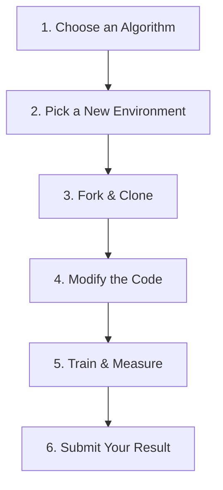

# Build Your Own Agent: The Fork & Modify Challenge

Reading about reinforcement learning is good. Implementing it is better. But the absolute fastest way to master RL is to **take an existing, working agent and break it.**

Instead of just reading this repository, we want you to create a derivative of it. Pick an algorithm, change the environment or the reward function, and see if you can get the agent to solve it.

This process is how you bridge the gap between theory and intuition.

---

## The Workflow



---

### Step 1: Choose an Algorithm

Start by picking an algorithm that you understand conceptually. If you are a beginner, do not start with PPO or SAC.

- **Beginner**: Q-Learning or SARSA (from `rl_maze_solver`)
- **Intermediate**: Deep Q-Networks (from `green-logistics-optimizer`)
- **Advanced**: Soft Actor-Critic (from `rocket-lander-sac`)

### Step 2: Pick a New Environment

You need an environment with the same action space type (discrete vs continuous) as your chosen algorithm. We recommend using [Gymnasium](https://gymnasium.farama.org/).

- **For Q-Learning / DQN (Discrete Actions)**:
  - `CartPole-v1`
  - `FrozenLake-v1`
  - `Acrobot-v1`
- **For SAC / PPO (Continuous Actions)**:
  - `BipedalWalker-v3`
  - `Pendulum-v1`
  - `HalfCheetah-v4`

### Step 3: Fork and Clone

Don't start from an empty folder. Fork the Lab and rip out the parts you don't need.

```bash
# 1. Fork the repository on GitHub
# 2. Clone your fork
git clone https://github.com/YOUR_USERNAME/reinforcement-learning-lab.git
cd reinforcement-learning-lab

# 3. Copy a starter project to a new folder
cp -r rl_maze_solver my_custom_agent
cd my_custom_agent
```

### Step 4: Modify the Code

Open your new project in your editor. You only need to change two things to get started:

1. **The Environment Instance**: Replace the custom environment initialization with your Gymnasium environment:
   ```python
   import gymnasium as gym
   env = gym.make("CartPole-v1")
   ```
2. **The State/Action Shapes**: Ensure your neural network (or Q-table) correctly reads the observation space shape and action space size of the new environment.

*Challenge: Try changing the reward function! For example, in CartPole, try giving the agent a penalty for moving too far from the center, not just for falling over.*

### Step 5: Train and Measure

Run your training loop.

```bash
python train.py
```

Watch the agent fail. Reinforcement learning almost never works on the first try.
- Is the reward increasing at all?
- Is the loss exploding?
- Did you tune the learning rate?

Adjust your hyperparameters and try again.

### Step 6: Submit Your Result!

Once your agent successfully solves the environment, don't keep it to yourself! 

The open-source community thrives on shared knowledge. Head over to our **[GitHub Discussions](https://github.com/Dash10107/reinforcement-learning-lab/discussions)** and post your result in the "Show and Tell" category.

**Include in your post:**
- Which environment you chose.
- Which algorithm you used.
- The hardest bug you had to fix.
- A GIF or screenshot of your agent succeeding.

> [!TIP]
> **Need a completely blank slate?** Check out our [Starter Templates](./starter-templates.md) for bare-minimum PyTorch implementations of the core training loops without the interactive Gradio dashboards.
